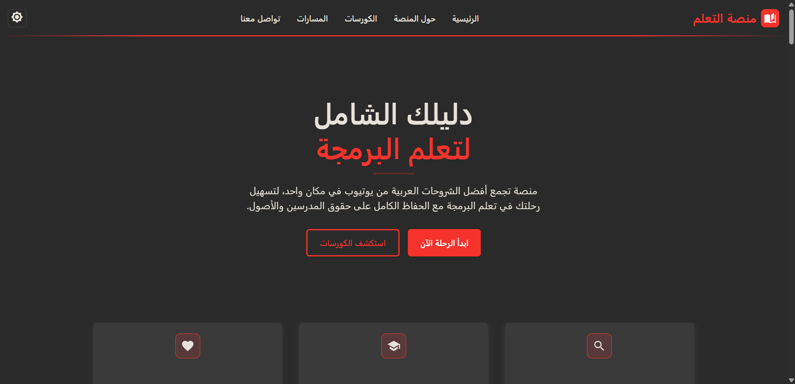

# منصة التعلم - Learning Platform

<div dir="rtl">
<div>
    
  </div>

## نظرة عامة

منصة تعليمية عربية تجمع أفضل الشروحات البرمجية من يوتيوب في مكان واحد، مع الحفاظ الكامل على حقوق المدرسين والمحتوى الأصلي.

## الهدف

تبسيط رحلة تعلم البرمجة للمستخدمين العرب من خلال تجميع وتنظيم أفضل المحتويات التعليمية في واجهة واحدة سهلة الاستخدام.

## المميزات

- **بحث ميسر**: تجميع أفضل الشروحات من مختلف القنوات
- **مسارات تعليمية**: مسارات متكاملة للمبتدئين والمتقدمين
- **تعليم مجاني**: جميع الكورسات مجانية مع الحفاظ على حقوق المدرسين
- **جودة مضمونة**: اختيار أفضل الشروحات من المدرسين الموثوقين
- **تصميم متجاوب**: متوافق مع جميع الأجهزة
- **وضع ليلي**: تجربة استخدام مريحة في جميع الأوقات

## المسارات التعليمية

- **مسار تطوير واجهات الويب (Frontend Web Development)**
- **مسار تطوير الخوادم (Backend Web Development)**
- **مسار تطوير تطبيقات الموبايل (Frontend App Development)**
- **مسار أساسيات البرمجة (Programming Basics)**
- **مسار تصميم واجهات وتجربة المستخدم (UI/UX Design)**

## التقنيات المستخدمة

- **Frontend**: React.js, TypeScript
- **UI Framework**: Material-UI
- **Routing**: React Router
- **Styling**: Emotion, CSS3
- **Icons**: Material-UI Icons
- **Build Tool**: Vite

## كيفية التشغيل

### المتطلبات الأساسية

- Node.js (الإصدار 16 أو أعلى)
- npm أو yarn

### خطوات التثبيت

```bash
# استنساخ المشروع
git clone https://github.com/Su03l/education-platform.git
cd education-platform

# تثبيت dependencies
npm install

# تشغيل بيئة التطوير
npm run dev

# بناء المشروع للإنتاج
npm run build
```

## هيكل المشروع

```
src/
├── assets/        # الصور والفيديوهات والايقونات
├── components/    # المكونات المشتركة
├── context/       # سياق React (مثل الثيمات)
├── data/          # البيانات الثابتة (مثل معلومات الكورسات)
├── pages/         # صفحات التطبيق
└── styles/        # ملفات التصميم
```

## الألوان والثيمات

### الثيم الفاتح

```css
--primary-color: #f5332c
--secondary-color: #f2f2f2
--background-color: #ffffff
--text-color: #1a1a1a
```

### الثيم الداكن

```css
--primary-color: #f5332c
--secondary-color: #3a3a3a
--background-color: #2a2a2a
--text-color: #e6e1d9
```

## التواصل

- **تويتر**: [@su05l](https://twitter.com/su05l)
- **GitHub**: [Su03l](https://github.com/Su03l)
- **LinkedIn**: [Suliaman Yousef](https://www.linkedin.com/in/suliaman-yousef-36265a320)

## ملاحظات مهمة

- **مشروع تدريبي**: تم تطوير هذا المشروع بعد إكمال كورس React
- **تجميع محتوى**: المنصة لا تنتج محتوى بل تجمع الشروحات الحالية
- **حقوق الملكية**: جميع الحقوق محفوظة لأصحاب المحتوى الأصلي
- **روابط مباشرة**: جميع الشروحات مرتبطة بمصادرها الأصلية على يوتيوب

## المساهمة

نرحب باقتراحات الكورسات الجديدة! راسلنا على تويتر مع:

- اسم الكورس
- رابط اليوتيوب
- اسم المدرس

## الرخصة

هذا المشروع تم تطويره لأغراض تعليمية وتدريبية. جميع حقوق المحتوى التعليمي تعود لأصحابها الأصليين.

---

**تم انشاء هذا الموقع لمساعدة وتسهيل التعلم للاخرين**

</div>
